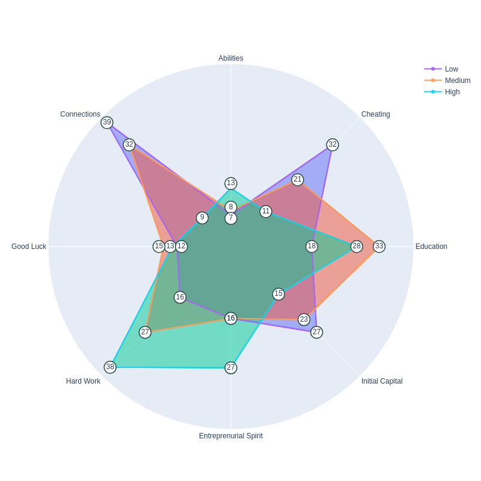

<!--  -->

This is a tiny example of how to represent some data into a radar chart. The data was taken from
<a href=https://www.makeovermonday.co.uk/data/data-sets-2017/, target="blank"> MakeoverMonday </a>, it is the data set of week 13 of 2017.
Accordingly to that page, <i> representatives of different social strata were asked the same question: "What are the mail reasons of success?" </i>

However, it does not include the source, what was considered as high/medim/low social-economic strata and how was the methodology to collect the data.

Note: It is not my data and it does not represent my believes.
