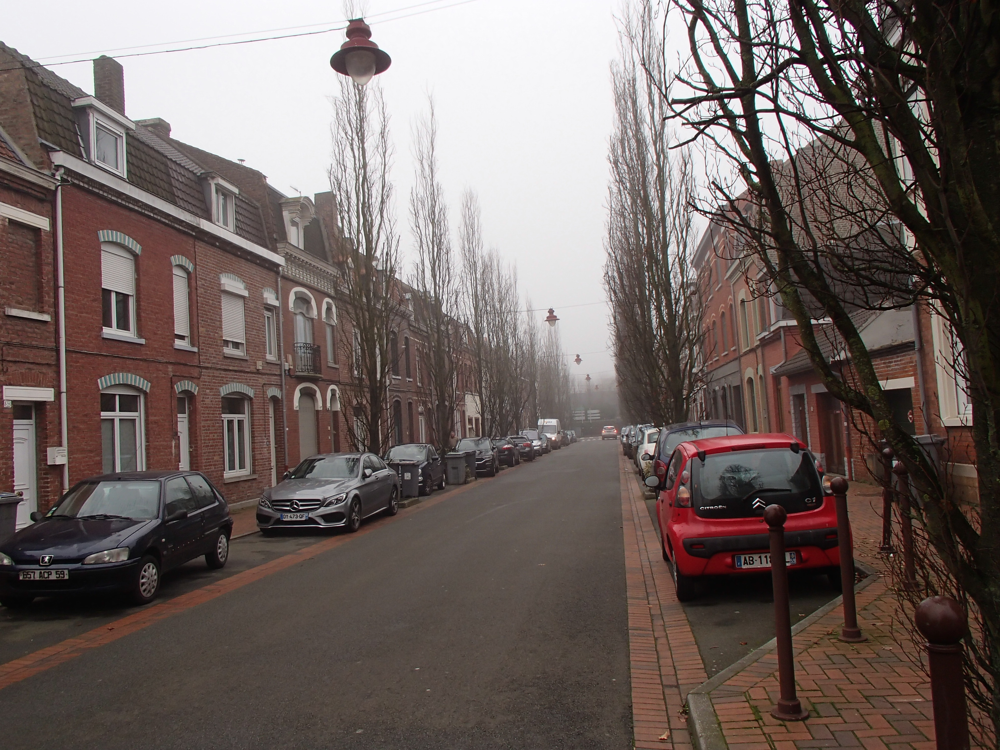
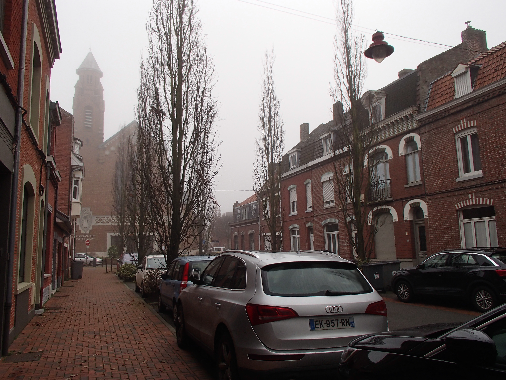

Este blog está destinado a compartir mis experiencias durante mi estancia de investigación en Inria-Lille 2020

# Enero
## 25/01/2020

Bueno, tengo casi dos semanas en Lille, y como ya se me pasó el jet lag, puedo empezar a escribir aquí y contarles un poco sobre cosas que encuentro interesantes o
situaciones curiosas que me han pasado. Hay más cosas por decir, pero después se las iré contando.

<b> El clima </b>

Las temperaturas no son muy bajas (solemos estar como entre -2°C y 4°C), pero todo el tiempo hay niebla,
literalmente todo el tiempo. Desde que llegué aquí no he visto que salga el Sol ni tantito, el cielo sólo pasa de gris claro por la mañana a gris oscuro por la tarde.
Según los dueños de la casa donde rento, es de lo más normal el cielo gris y seguirá todo el invierno. El problema de la niebla es que trae mucha humedad,
lo que hace que sienta más frío, pero mientras traigas una buena chamarra todo está bien. Lo malo es cuando comienza el viento, porque entonces sí que se
siente un friazo y ya ni vez gente en la calle.

<b> La gente </b>

Aquí la gente suele ser muy fría al comienzo, así que no esperes cálidas bienvenidas ni que hablen contigo. En mi oficina, por ejemplo, sólo sé el nombre de dos de
mis compañeros porque los demás no pasan de un bonjour y un au revoir. Dice Jill-Jênn que aún así hay partes de Francia (coff... coff.. París) donde la gente es
mucho más fría y él cree que mis compañeros de oficina han sido así porque están muy cerca los deadlines de varios proyectos en Inria, así que una vez que
pasen quizás hablen más (yo lo dudo).

<b> El francés y el inglés </b>

Me inscribí a un gimnasio pues para hacer algo de ejercicio, ver si habría alguien con quien hablar y mejorar mi francés (ya que en mi oficina ni hablan). Pude platicar
un poco en francés con el entrenador, pero al primer problema me preguntó que si hablaba inglés. De allí para adelante todas nuestras pláticas han sido en inglés,
salvo por los saludos y algunos detalles. Así que adiós a mi oportunidad de mejorar mi francés en el gimnasio.

Algún día de esta semana estaba buscando algún local de comida francesa con precios decentes, encontré varios restaurantes de comida tailandesa y vietnamita
(incluso encontré uno de comida mexicana), pero
ninguno francés, seguramente estaba buscando en el lado equivocado de la ciudad. Después de un rato de seguir buscando ningún restaurante francés y terminé por entrar
en un local que vendía hamburguesas. Apenas y dije bonjour al hombre que tomaba las órdenes, se dio la media vuelta y se fue por su cuate que hablaba inglés, así
que vino otro hombre a atenderme, al principio seguí hablando en francés y todo iba bien, hasta que regresó el primer hombre y le dijo que mejor
me hablara en inglés, para que le entendiera bien. Así que el hombre que me estaba tomando la orden me preguntó que si hablaba inglés y después de asentir ya ni si
quiera le intentó, toda la plática fue en inglés. Curiosamente, cuando estaba terminando de ordenar, me dice "¿eres mexicanos?", yo todo sacado de onda le dije que sí y
después me comentó que una vez había trabajado con unos mexicanos y que tengo el mismo acento que ellos cuando hablo francés.

Ese mismo día le pedí (en francés) indicaciones a un guardia de un centro comercial, él guardia ni siquiera me preguntó si hablaba inglés o no, sino que
me empezó a hablar en español y me dijo que tenía un acento de
hispanohablante cuando hablo francés. No sé cuál sea ese acento, pero es evidente para las personas de acá.

Como cada vez que quiero hablar francés con alguien, terminan cambiando por hablar en inglés (o español), así que parece que mi francés no va a mejorar tanto como mi
inglés, tal vez la siguiente vez que alguien quiera hablar inglés conmigo actúe como que no entiendo para forzarlos a hablar francés.

# Galería

<b> Mi calle </b>

