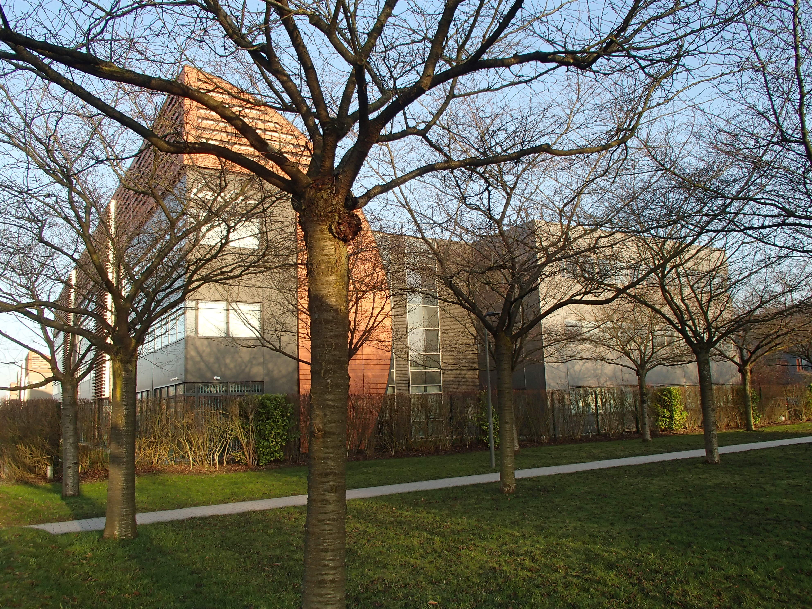
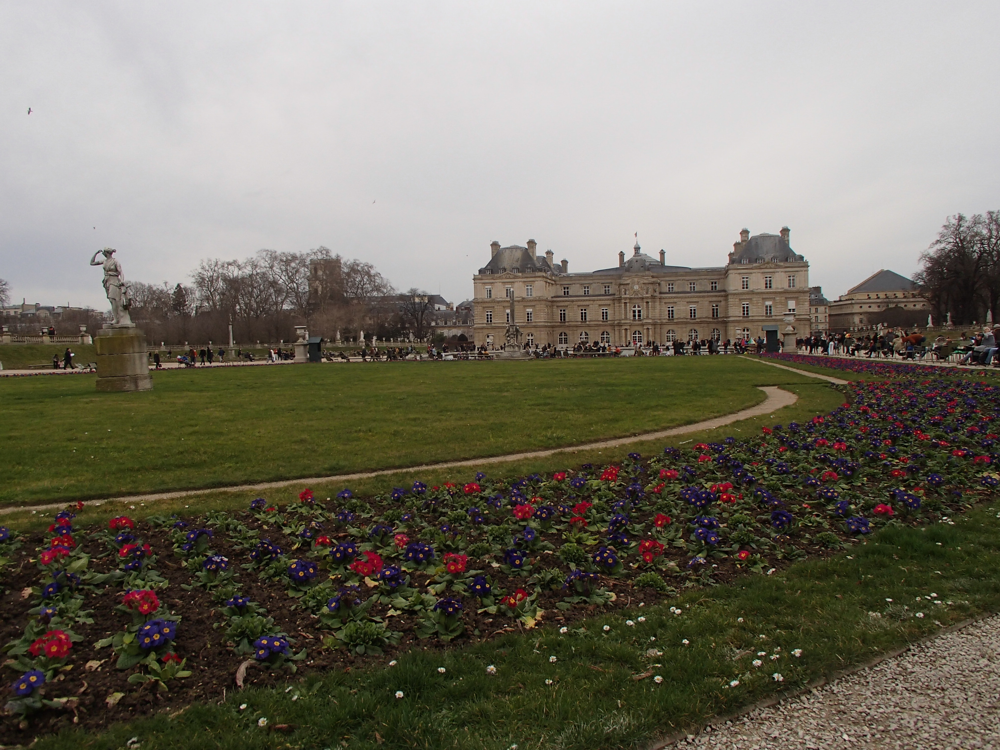
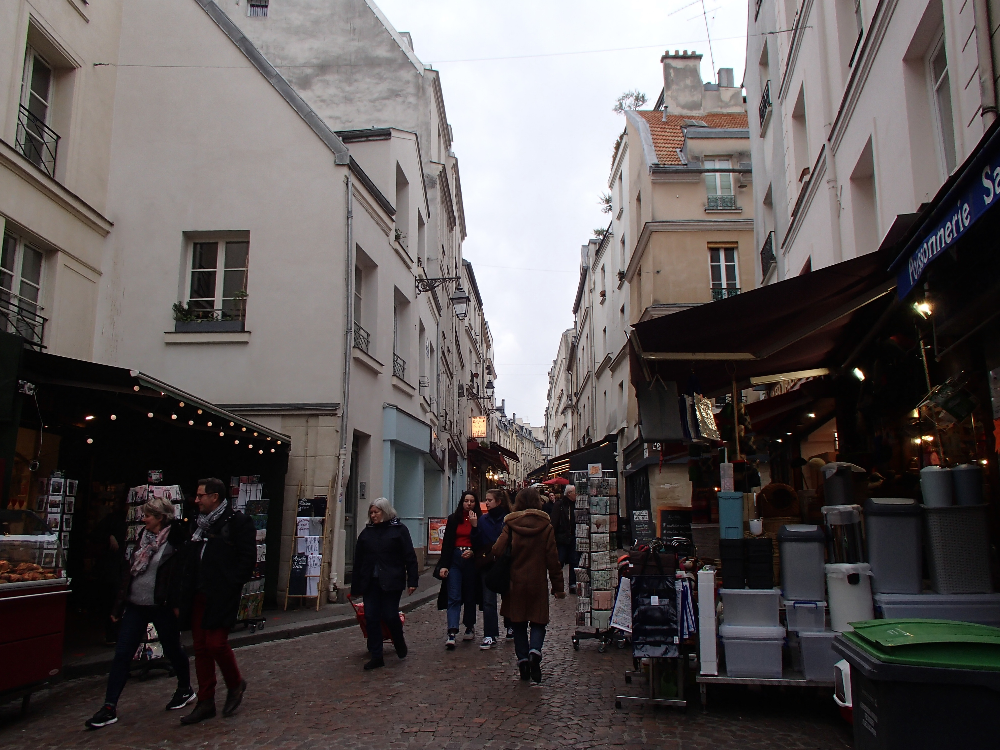

Este blog está destinado a compartir mis experiencias durante mi estancia de investigación en Inria-Lille 2020

# Enero
## 25/01/2020

Bueno, tengo casi dos semanas en Lille, y como ya se me pasó el jet lag, puedo empezar a escribir aquí y contarles un poco sobre cosas que encuentro interesantes o
situaciones curiosas que me han pasado. Hay más cosas por decir, pero después se las iré contando.

<b> El clima </b>

Las temperaturas no son muy bajas (solemos estar como entre -2°C y 4°C), pero todo el tiempo hay niebla,
literalmente todo el tiempo. Desde que llegué aquí no he visto que salga el Sol ni tantito, el cielo sólo pasa de gris claro por la mañana a gris oscuro por la tarde.
Según los dueños de la casa donde rento, es de lo más normal el cielo gris y seguirá todo el invierno. El problema de la niebla es que trae mucha humedad,
lo que hace que sienta más frío, pero mientras traigas una buena chamarra todo está bien. Lo malo es cuando comienza el viento, porque entonces sí que se
siente un friazo y ya ni vez gente en la calle.

<b> La gente </b>

Aquí la gente suele ser muy fría al comienzo, así que no esperes cálidas bienvenidas ni que hablen contigo. En mi oficina, por ejemplo, sólo sé el nombre de dos de
mis compañeros porque los demás no pasan de un bonjour y un au revoir. Dice Jill-Jênn que aún así hay partes de Francia (coff... coff.. París) donde la gente es
mucho más fría y él cree que mis compañeros de oficina han sido así porque están muy cerca los deadlines de varios proyectos en Inria, así que una vez que
pasen quizás hablen más (yo lo dudo).

<b> El francés y el inglés </b>

Me inscribí a un gimnasio pues para hacer algo de ejercicio, ver si habría alguien con quien hablar y mejorar mi francés (ya que en mi oficina ni hablan). Pude platicar
un poco en francés con el entrenador, pero al primer problema me preguntó que si hablaba inglés. De allí para adelante todas nuestras pláticas han sido en inglés,
salvo por los saludos y algunos detalles. Así que adiós a mi oportunidad de mejorar mi francés en el gimnasio.

Algún día de esta semana estaba buscando algún local de comida francesa con precios decentes, encontré varios restaurantes de comida tailandesa y vietnamita
(incluso encontré uno de comida mexicana), pero
ninguno francés, seguramente estaba buscando en el lado equivocado de la ciudad. Después de un rato de seguir buscando ningún restaurante francés y terminé por entrar
en un local que vendía hamburguesas. Apenas y dije bonjour al hombre que tomaba las órdenes, se dio la media vuelta y se fue por su cuate que hablaba inglés, así
que vino otro hombre a atenderme, al principio seguí hablando en francés y todo iba bien, hasta que regresó el primer hombre y le dijo que mejor
me hablara en inglés, para que le entendiera bien. Así que el hombre que me estaba tomando la orden me preguntó que si hablaba inglés y después de asentir ya ni si
quiera le intentó, toda la plática fue en inglés. Curiosamente, cuando estaba terminando de ordenar, me dice "¿eres mexicanos?", yo todo sacado de onda le dije que sí y
después me comentó que una vez había trabajado con unos mexicanos y que tengo el mismo acento que ellos cuando hablo francés.

Ese mismo día le pedí (en francés) indicaciones a un guardia de un centro comercial, él guardia ni siquiera me preguntó si hablaba inglés o no, sino que
me empezó a hablar en español y me dijo que tenía un acento de
hispanohablante cuando hablo francés. No sé cuál sea ese acento, pero es evidente para las personas de acá.

Como cada vez que quiero hablar francés con alguien, terminan cambiando por hablar en inglés (o español), así que parece que mi francés no va a mejorar tanto como mi
inglés, tal vez la siguiente vez que alguien quiera hablar inglés conmigo actúe como que no entiendo para forzarlos a hablar francés.

# Febrero
## 09/02/2020

Hoy tenía pensado salir para mostrarles algo sobre la ciudad. Pero está lloviendo, hace frío y estoy atrasado con mi trabajo. Así que mejor me he quedado a trabajar
y, mientras me tomo en descanso, les cuento un poco más. Por cierto, he tenido algunos problemas para poner imágenes aquí en un tamaño descente, pero mientras tanto les
dejo unas fotos de mi linda calle, de Inria y de algunas otras calles aleatorias de la ciudad. Después les pondré fotos de edificios más emblemáticos.

<b> Inria </b>

Inria es un instituto de investigación enorme con 8 centros repartidos por todo el país (Bordeaux, Grenoble, Lille, Nancy, Paris, Rennes, Sacle y Sophia Antipolis).
Con un gran número de equipos de investigación. El centro Inria Lille-Nord Europe cuenta con 14 equipos de investigación, uno de ellos es Sequel
(pueden saber un poco más sobre el equipo <a href="https://team.inria.fr/sequel">aquí</a>).
La mayoría de los equipos de investigación de Inria se enfocan en el área del cómputo, pero también hay gente que realiza investigación en genómica y física.
Sequel se dedica al aprendizaje de las máquinas (por cierto, si alguien sabe cómo hacer jalar un Variational Autoencoder con TensorFlow2, sea buena gente y
páseme el código para que pueda salir a pasear).

<b> Los horarios </b>

Definitivamente lo más difícil a adaptarse acá son los horarios. Y es que casi todo está cerrado entre las 2pm y las 6pm o 7 pm, por alguna razón extraña.
Al principio creí que sería porque se van a comer, ¡pero incluso los restaurantes están cerrados a esa hora! Ya me ha pasado como unas 3 veces que quiero ir a comer algo y
TODO está cerrado, así que tengo que regresar a mi casa con mucha más hambre y a ver qué como. A mí me parecía ridículo que incluso los restaurantes cerraran a la
hora de la comida, después de todo es su negocio. Pero estaba equivocado, los restaurantes no cierran a la hora de la comida, sino que
la ENORME mayoría de los franceses come a las 12:00 (los que he visto comer más tarde
lo hacen por mucho a la 1pm o 1:30), y después los restaurantes cierran hasta la noche. 
Así que o vas a desayunar o vas a cenar, porque a la hora de la comida no hay nada,
(a menos claro que tu hora de comida sea a medio día). Después de que comen a medio día, los franceses no vuelven a comer hasta como las 7 pm.
Yo no sé como le hacen, porque si yo como
a la 1pm paralas 5pm ya tengo hambre y estoy comiendo galletitas o alguna fruta o me voy a mi casa.
Y si te estás preguntando que hacen los franceses entre las 2pm y las 7pm, pues algunos salen a correr o van a hacer ejercicio.

En otra ocasión, fui al supermercado después de ir al gimnasio (osea eran poco antes de las 8pm). Y era el ÚNICO cliente en la tienda, y me trajeron a la carrera
porque ya iban a cerrar ¿¡Qué cadena de supermercados cierra a las 8 pm!? Aunque hay algunas tiendas que cierran más tarde, la mayoría cierra a esa hora.

Ah y olvídate de salir los domingos a comer, TODO está cerrado, ¿en verdad los franceses tienen ganas de cocinar en domingo?

Yo simplemente no entiendo nada el horario de la gente aquí.

<b> El transporte </b>

Si la armas en México, Francia es papita. Igual que en el metro de DF, te compras una tarjetita de unos 2 EUR, y le vas abonando viajes ¡y ya! eso es todo, así de
simple. Con esa misma tarjetita pagas el metro, el tranvía y los autobuses. En algunas estaciones no hay puertas ni torniquetes que te impidan hacer uso del servicio, 
pero aun así debes pagar simplemente presentando la tarjeta a las máquinas que cobran a la entrada. A veces hay inspecciones aleatorias (sobre todo en correspondencias o 
terminales o sea que ni tan aleatorio), en donde unas personas con una maquinita se ponen a leer las tarjetas para asegurarse que pagaste el servicio, y si no lo hiciste, pues te multan.
La primera vez que vi un grupo de estas personas, como yo no sabía que hacían, me seguí de frente ignorándolos y uno de ellos me persiguió por la estación para que
le mostrara mi tarjeta y ya estaba listo para multarme. Y sí, hay algunos franceses que se suben sin pagar, y ya me ha tocado ver como unas 4 veces que le están
levantando una multa a alguien.

## 23/02/2020

Hoy les quiero platicar de dos cosas. Lo primero de lo que quiero hablar es sobre franglish, una idea gracias a la cual finalmente comienzo a tener una vida social.
Lo segundo de lo que quiero hablarles es de mi viaje a París el pasado fin de semana.

<b> Franglish </b>

Los franceses pueden ser sumamente fríos. Así que no esperes que te inviten a ninguna fiesta o a salir a tomar algo, ni siquiera esperes que tus compañeros en la
oficina te saluden o se despidan. Simplemente cuando llegan van directo a su esrcitorio y cuando se van, pues toman sus cosas y se salen. Y cuando es la hora de comer
(osea medio día), simplemente se levantan y se van, no esperes que te inviten a ir a comer, porque de hecho, ni siquiera entre ellos se invitan a comer. Y según los
mismos franceses (al menos con los que he podido platicar un poco) los parisinos son los peores. Así que es muy difícil tener vida social por acá.

Y aunque pueda paracer que soy un exagerado drama queen, la verdad es que he podido platicar al menos con otros dos extranjeros que viven aquí y opinan cosas similares.
Uno de ellos, un marroquí que vino a estudiar la universidad acá me coentaba que cuando llegó, fue él quien tuvo que invitar a sus compañeros a salir para comenzar a
tener vida social, lo que le parecía ridículo, que una persona que apenas llega a la ciudad y que no la conoce sea la que tiene que invitar a los habitantes de aquí
y actuar como si él les estuviera dando la bienvenida. Osea que si no te pones las pilas acá puedes terminar solo solo solo. Lo que me lleva a ¡franglish!
¡la idea para romper ese sistema solitario!

Hay un café en Lille llamado Queen's Head, en donde cada martes después de las 7pm se reune un grupo de personas, pues para echar chisme. Una parte del grupo son
extranjeros que, como yo, quieren mejorar su francés. La otra parte del grupo son en su mayoría franceses/lillois (lillois es el gentilicio de Lille)
que quieren mejorar su inglés. Y la dinámica es muy simple, vas, compras una cerveza, una copa de vino o alguna otra cosa y platicas durante 7 minutos en francés con
alguien y durante 7 minutos en inglés, después cambias de mesa y platicas con la siguiente persona, hasta como las 9pm (o cuando te aburras). ¡Y en 14 minutos supe
más sobre estas personas que sobre mis compañeros de la oficina durante un mes! Aunque en realidad simplemente con saber sus nombres ya sabía más sobre ellos.

Este martes fue la primera vez que fui y la verdad es que no tenía grandes espectativas, pensé que sería apenas un pequeño grupo de personas y nada más
(y que sería demasiado aburrido), pero de hecho va una buena cantidad de persona, es divertido y finalmente tengo recomendaciones de restaurantes donde puedo comer
comida francesa. De lo único que me arrepiento es de no haber ido antes.

Oh, una cosa más, creo que hay otras ciudad en donde también existe el franglish. Si alguna vez están una estancia larga por acá, definitivamente vayan lo más pronto
posible al franglish.

<b> París </b>

Hay un par de maneras de ir de Lille a París. Puedes tomar un autobús, ir en algún auto compartido o tomar el tren de gran velocidad (TGV), el más rápido claro es el
TGV, pero también puede ser algo caro. Ahora si vas a tomar el TGV definitivamente te recomiendo que compres primera clase, al menos en los boletos que yo compré,
la diferencia en precio entre primera clase y segunda clase eran 2EUR, osea te compras 4 limones o 4 jitomates y ya te gastaste 2EUR (sí, el precio de las frutas y
las verduras es ridículamente alto), pero la diferencia en la comodidad es ENORME.

Siempre creí que la belleza de la ciudad no correspondería con su popularidad. Osea, que París es una ciudad fea pero famosa. Y debo admitir que me equivoqué, el centro
de París es muy bello. Yo creía que algunos edificios icónicos de la ciudad, como el Louvre, destacarían sobre los edificios de su alrededor, pero la verdad es que todos
los edificios del centro de París son sumamente bellos. Además, el centro de la ciudad está adornado con varias esculturas por distintos lugares y con varios parques.

La segunda cosa que creí que no correspondería con su popularidad era la torre Eiffel. Y sobre eso no me equivoqué, la Eiffel es FEA, pero fea en serio, horrorosa,
sin chiste y sin gracia. Los demás edificios del centro están adornados hasta el detalle, mientras que la Eiffel... Bueno, si has visto una antena de radio o una torre
de alta tensión en la carretera, pues ya viste la Eiffel, imagínatela un poco más alta. Sólo por la noche es que se ve linda la antena, pero eso es porque la
cantidad de luces que tiene logra ocultar lo fea que es. Aún así, como buen turista me tomé algunas fotos allí xD. Pero, en mi opinión, si alguna vez vas a París,
no pierdas el tiempo allí, toma una o dos fotos y vete a otro lado. Por ejemplo podrías ir al Hôtel des Invalides (que está por allí cerca) a ver la tumba de Napoleón
o pasear por sus dstintos museos.

También te recomiendo que te salgas un poco de la calle de atracciones principales, la cual no tengo ni idea de cómo se llama, pero es la que va desde el Arco del Triunfo,
la Concorde, el Louvre y la Place de Bastilla, y vayas a otros lugares. Por ejemplo, puedes quedarte un rato descansando en el Jardín de Luxemburgo. Y definitivamente
antes de irte ve al Sacré Coeur, desde donde puedes ver una buena parte del centro y algunos lugares por los que quizás paseaste.

Los mismos franceses creen que en los restaurantes y bares parisinos el servicio es pésimo y que los meseros son sumamente groseros, además de que los platillos por el
centro de la ciudad son muy caros, están entre los 15EUR o 20EUR (sin incluir bebidas), al menos lo que yo vi.
Y en opinión de algunos franceses ni siquiera están bien servidos. Así que si viajas con poco dinero, como yo, también te recomiendo que pases por la calle de Mouffetard.
A ambos lados de la calle hay varios restaurantes a precios accesibles,
claro que tampoco esperes comida gourmet ni el plato más grande que hayas comido, pero para quitarte el hambre a un precio razonable para seguir paseando, está bien.

Como fui en plan de viajero austero, me hospedé en un cuarto de un departamento ya a las orillas de la ciudad. Y no sé cómo sean en el centro de la ciudad, pero una vez
comí en un pequeño restaurate por allí y me trataron muy bien. Además que la persona que me hospedó fue muy amigable. Así que si sientes que los parisinos son muy groseros
a lo mejor simplemente te falta ir un poco más lejos del centro. Hay una cosa más de la que me pude percatar y que pocos te dirán, una vez que sales del centro turístico,
París es un desmadre. Osea para pasear por su centro esá chido, pero para vivir allí.... pff que horror, a menos que te guste el desmadre (algo así como el DF pues).

<b> Lille </b>

Para conlcuir por su tortura de haber leído toooodo lo que escribí hoy. Remataré diciendo que, aunque el centro de París es bello, Lille me parece una ciudad mucho más
bella (y no sólo su centro) y definitivamente una mejor ciudad para vivir. Y, aunque ya me han de tachar de mentiroso a estas alturas, prometo subir pronto fotos de
lugares icónicos de Lille. Por cierto, si se lo preguntaban, hoy el día estuvo nublado, lloviendo, con niebla y con viento; osea como cualquier típico día en Lille.



+++
[[gallery_item]]
  album = "Galeria"
  image = "Calle Random_2.JPG"
  caption = "captione"
+++

# Galería
## Enero

<b> Mi calle </b>

## Febreo

<b> Inria </b>

<b> Calles de Lille </b>

<b> París </b>

