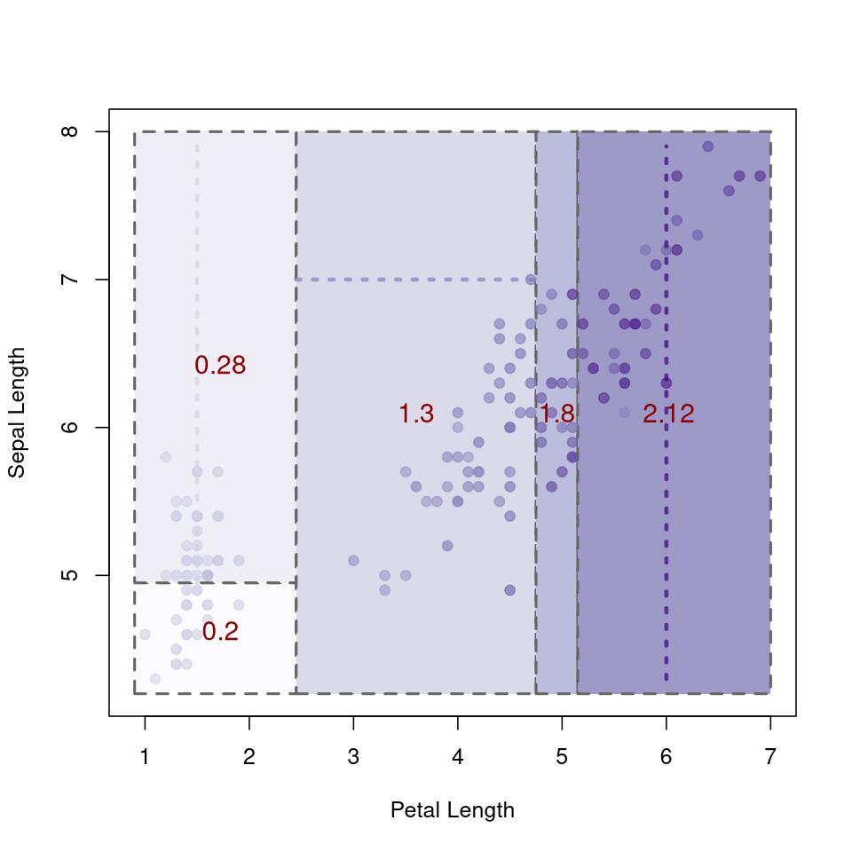

---
# Course title, summary, and position.
linktitle: Random Forests with Missing Data
summary:
weight: 1

# Page metadata.
title: Random Forests with Missing Data
draft: false  # Is this a draft? true/false
toc: false  # Show table of contents? true/false
type: docs  # Do not modify.

# Add menu entry to sidebar.
# - name: Declare this menu item as a parent with ID `name`.
# - weight: Position of link in menu.
menu:
  rf_w_miss:
    name:
    weight: 1
---

The codes to construct random forests with missing data are found in <a href="https://github.com/IrvingGomez/Random_forests_with_missing_values">https://github.com/IrvingGomez/Random_forests_with_missing_values</a>. There is possible to find examples on its use, in particular the example <a href="https://github.com/IrvingGomez/Random_forests_with_missing_values/blob/main/examples/Example_Anderson%20iris.ipynb">Example_Anderson iris.ipynb</a> shows must of the features.

Here are two images with the graphics that are possible to obtain, representing a decision tree with missing values.

 
