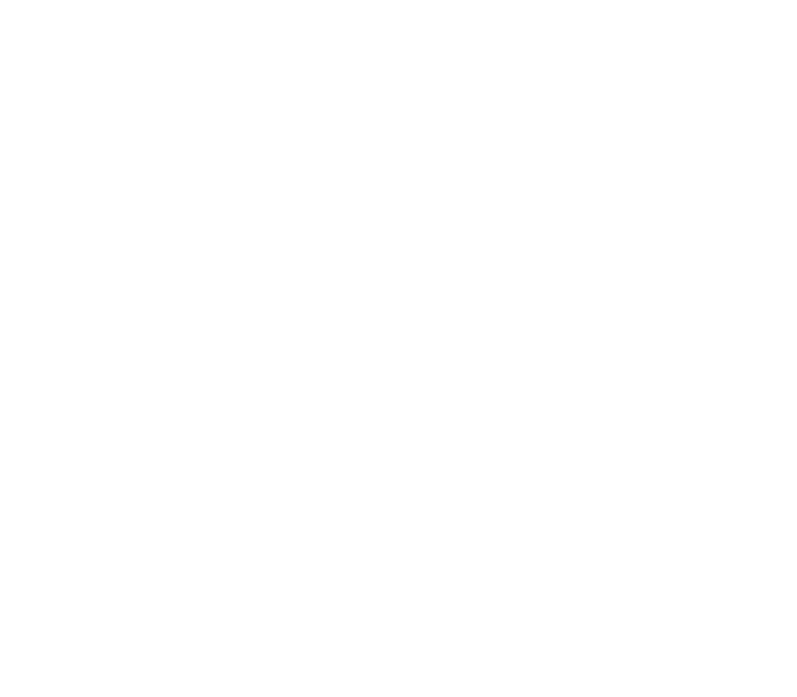

<nav class="section-nav">
  <ul>
    <li> World Happiness Report 2017 </li>
    <ul>
      <li> Maps and Related Visualizations</li>
      <ul>
        <li><a href="https://irvinggomez.com/miscellanea/Ladder/">Happiness score or subjective well-being</a></li>
	      <li><a href="https://irvinggomez.com/miscellanea/GDP/">Logarithm of GDP per capita based on PPP</a></li>
        <li><a href="https://irvinggomez.com/miscellanea/SocSupp/">Having someone to count on in times of trouble</a></li>
        <li><a href="https://irvinggomez.com/miscellanea/HealthExp/">Healthy life expectancy at birth</a></li>
        <li><a href="https://irvinggomez.com/miscellanea/Freedom/">Freedom to make life choices</a></li>
        <li><a href="https://irvinggomez.com/miscellanea/Generosity/">Have you donated money to a charity in the past month?</a></li>
        <li><a href="https://irvinggomez.com/miscellanea/ConfGov/">Confidence in Government</a></li>
        <li><a href="https://irvinggomez.com/miscellanea/PossAffect/">Happiness, Laugh and Enjoyment (Possitive Affect)</a></li>
        <li><a href="https://irvinggomez.com/miscellanea/NegAffect/">Worry, Sadness and Anger (Negative Affect)</a></li>
        <li><a href="https://irvinggomez.com/miscellanea/Corrupt/">Perception of Corruption in the World</a></li>
        <li><a href="https://irvinggomez.com/miscellanea/Household/">Gini of household income</a></li>
      </ul>
      <li> Data sets</li>
      <ul>
	      <li><a href="https://irvinggomez.com/miscellanea/whr2017.csv">Original data set</a></li>
        <li><a href="https://irvinggomez.com/miscellanea/Data_164_countries.csv">Imputed data set</a></li>
      </ul>
    </ul>
    <li>The main reasons of success</li>
    <ul>
      <li> <a href="https://irvinggomez.com/miscellanea/Success/">Example of a radar chart</a></li>
    </ul>
    <li>Poverty in Mexico 2018</li>
    <ul>
      <li><a href="https://irvinggomez.com/miscellanea/map_poverty_ae_mexico_with_topies.html">Map of poverty in Mexico, colors considering Dystopia and Utopia.</a></li>
      <li><a href="https://irvinggomez.com/miscellanea/map_poverty_ae_mexico_no_topies.html">Map of poverty in Mexico, colors considering the states.</a></li>
    </ul>
    <li>Testing</li>
    <ul>
      <li><a href="https://irvinggomez.com/miscellanea/decorator_example.ipynb">Map of poverty in Mexico, colors considering Dystopia and Utopia.</a></li>
      <li><a href="https://irvinggomez.com/miscellanea/decorator_example_1.ipynb">Map of poverty in Mexico, colors considering the states.</a></li>
      <li><a href="https://irvinggomez.com/miscellanea/decorator_example_2.ipynb">Map of poverty in Mexico, colors considering Dystopia and Utopia.</a></li>
      <li><a href="https://irvinggomez.com/miscellanea/ExamplesDecorators.ipynb">Map of poverty in Mexico, colors considering the states.</a></li>
    </ul>
  </ul>
</nav>
