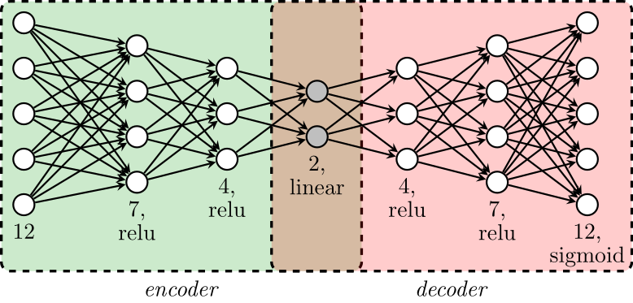

- Data source: World Happiness Report, using only the year 2016.
- Goal: understand the drivers behind happiness, not just the final score.
- Reference points: two hypothetical countries, `"utopia"` and `"dystopia"`.
- Interpretation: `utopia` takes the best observed value for every feature, while `dystopia` takes the worst.

<section id="Imputation Process">
  <h2>Imputation Process</h2>
</section>

Many countries have missing values in 2016, so the project required a dedicated imputation strategy.

**Why imputation was needed**

- Several countries are missing one or more features in 2016.
- First pass: use previous years and average historical records when they exist.
- Limitation: countries without historical records cannot be handled in that first step.
- Temporary decision: leave those countries aside until a second-stage model is available.

**How the integrated score was built**

- Standardize the usable data so each feature lies between `0` and `1`.
- Train an Autoencoder (AE) and use the encoder to project countries into a two-dimensional non-linear latent space.
- Use Principal Component Analysis (PCA) in that latent space to define the main one-dimensional ordering.
- Project `utopia` and `dystopia` onto that ordering after training.
- Define an integrated score from `0` to `10`, where `dystopia = 0` and `utopia = 10`.

**How the missing countries were recovered**

- Train a Random Forest (RF) on countries that already have an integrated score.
- Use that RF to estimate the score of countries with missing values and no historical records.
- Feed the final scores through the decoder part of the AE.
- Use the decoder reconstruction as the final imputation for the missing 2016 values.

This approach is more informative than simply averaging historical values, because the AE can capture more complex non-linear relationships among countries. An imputed version of the data was created as part of this project.

**Workflow summary**

<ol>
 <li>Train an AE and use its encoder.</li>
 <li>Use PCA in the latent space to assign an integrated score to each country.</li>
 <li>Use a RF to estimate the integrated score of countries with missing values.</li>
 <li>Use the AE decoder to reconstruct the missing features.</li>
</ol>

<section id="Visualizations">
  <h2>Visualizations</h2>
</section>

<section id="Maps and Histograms">
  <h3>Maps and Histograms</h3>
</section>

<!-- Script to say the function of the dropdwon button 'Select Variable' -->

<!-- Variable selector -->

    <label for="select_var"><strong>Variable</strong></label>
    <select class="happiness-select" name="select_var" id="select_var">
      <option value="ladder">Happiness score or subjective well-being</option>
      <option value="social">Someone to count on in times of trouble (Social Support)</option>
      <option value="corrupt">Perception of corruption</option>
    </select>

It is the national average response to the question: "Please imagine a ladder, with
steps numbered from 0 at the bottom to 10 at the top. The top of the ladder represents the best possible life for you and the bottom of the ladder
represents the worst possible life for you. On which step of the ladder would you say you personally feel you stand at this time?"

The measure is the national average responses to two questions: "Is corruption widespread throughout the government or not?" and
"Is corruption widespread within businesses or not?" The overall perception is just the average of the responses.

Social support (or having someone to count on in times of trouble) is the national average of the responses to the question "If you were in trouble,
do you have relatives or friends you can count on to help you whenever you need them, or not?"

<!-- Map of Ladder in low resolution -->

  

  

<!-- Map of Social Support in low resolution -->

  

  

<!-- Map of Corruption in low resolution -->

  

  

<!-- Hitogram of Ladder -->

  

  

<!-- Hitogram of Social Support -->

  

  

<!-- Hitogram of Corruption -->

  

  

<section id="Data Visualization in Latent Spaces">
  <h3>Data Visualization in Latent Spaces</h3>
</section>

<!-- Visualization selector -->

    <label for="select_view"><strong>Latent-space view</strong></label>
    <select class="happiness-select" name="select_view" id="select_view">
      <option value="pca_continent">Visualization: PCA (colored by continent)</option>
      <option value="pca_score">Visualization: PCA (colored by integrated score)</option>
      <option value="ae">Visualization: AE</option>
      <option value="hide">Hide visualization</option>
    </select>
    <small>Choose how to display the dimensionality-reduction view below.</small>

<!-- PCA Plot -->

  

  

  

  

<!-- Biplot -->

  

  

<!-- Auto-Encoder -->

  

  

  
  

  <figure class="latent-schema-figure">
    
    <figcaption>Autoencoder schema</figcaption>
  </figure>

<section id="Some comments about the world">
  <h3>Some comments about the world</h3>
</section>

**Main takeaways**

- Global inequality is enormous.
- Qatar reaches a GDP per capita of roughly 136,000 USD, while much of the world remains below 20,000 USD, and Burundi does not reach 400 USD.
- In parts of America and Africa, household income inequality is especially severe.
- Some countries combine low freedom with high sadness and anger.
- Large areas of the map turn red when we look at perceived corruption or generosity.
- There are also more hopeful signals.
- Countries such as Rwanda or Somalia stand out for their efforts against corruption.
- Much of the Americas appears stronger in happiness and enjoyment.
- Across much of the world, people still report that they have someone to count on in times of trouble.
