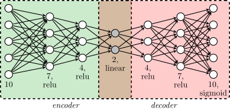

This page is a state-level exploration of Coneval's 2018 poverty data for Mexico. The raw data are public and available at <a href="https://www.coneval.org.mx/Medicion/MP/Paginas/Programas_BD_08_10_12_14_16_18.aspx">CONEVAL</a>.

The page has three goals:

- give a quick historical context for multidimensional poverty measurement
- explain the subset of indicators used here
- build an interpretable poverty ordering of Mexican states

# History

## Human Poverty Index
Before the Multidimensional Poverty Index, poverty was often summarized through the Human Poverty Index (HPI), introduced in 1997 as a complement to the Human Development Index.

There were two versions:

- `HPI-1` for developing countries
- `HPI-2` for high-income OECD countries

A short reference is available at <a href="https://en.wikipedia.org/wiki/Human_Poverty_Index">https://en.wikipedia.org/wiki/Human_Poverty_Index</a>.

<h3>HPI-1</h3>

The HPI-1 is given by the formula:

\[
\mathrm{HPI\text{-}1}
=
\left[
\frac{1}{3}
\left(
P_1^{\alpha} + P_2^{\alpha} + P_3^{\alpha}
\right)
\right]^{\frac{1}{\alpha}}
\]

where

<ul>
  <li> $P_1$: Probability at birth of not surviving to age 40 (times 100). </li>
  <li> $P_2$: Adult illiteracy rate. </li>
  <li> $P_3$: Arithmetic average of 3 characteristics:
    <ul>
      <li> The percentage of the population without access to safe water. </li>
      <li> The percentage of population without access to health services. </li>
      <li> The percentage of malnourished children under five. </li>
    </ul>
  </li>
  <li> $\alpha$: 3. </li>
</ul>

<h3>HPI-2</h3>

The HPI-2 is given by the formula:

\[
\mathrm{HPI\text{-}2}
=
\left[
\frac{1}{4}
\left(
P_1^{\alpha} + P_2^{\alpha} + P_3^{\alpha} + P_4^{\alpha}
\right)
\right]^{\frac{1}{\alpha}}
\]

where

<ul>
  <li> $P_1$: Probability at birth of not surviving to age 60 (times 100). </li>
  <li> $P_2$: Adults lacking functional literacy skills. </li>
  <li> $P_3$: Population below income poverty line (50% of median adjusted household disposable income). </li>
  <li> $P_4$: Rate of long-term unemployment (lasting 12 months or more). </li>
  <li> $\alpha$: 3. </li>
</ul>

## Multidimensional Poverty Index

In 2010, poverty measurement moved toward a multidimensional framework. Mexico played a central role in that transition through Coneval, the autonomous institution responsible for evaluating social development policy.

### History of the Multidimensional Poverty Index in Mexico
The full story is documented by Coneval at <a href="https://www.coneval.org.mx/Medicion/MP/Documents/Como_logro_construir_la_medicion_de_Coneval%20(1).pdf">this report</a>. The short version is:

1. In 2001, the Mexican federal government organized the symposium `Pobreza: Conceptos y Metodologias` because there was still no consensus on how poverty should be measured.
2. The same year, the `CTMP` was created to design an official indicator.
3. That indicator was expected to be:

- simple to communicate
- consistent with common sense
- statistically robust
- easy to replicate

4. Early official indicators appeared in 2002 and 2004.
5. Distrust in government statistics helped motivate the creation of Coneval, which began operating in 2006.
6. From 2006 onward, Coneval built the conceptual and statistical framework for multidimensional poverty measurement using INEGI data sources such as the MCS and ENIGH surveys.

The key methodological shift was clear:

- poverty should not be reduced to income alone
- social rights and economic well-being should be analyzed together
- the framework should remain transparent and reproducible

Coneval's formal methodology is documented here:

<a href="https://www.coneval.org.mx/InformesPublicaciones/InformesPublicaciones/Documents/Metodologia-medicion-multidimensional-3er-edicion.pdf">Methodology for the multidimensional measurement in Mexico</a>

Mexico was the first country to implement this approach nationally, and related versions later influenced poverty measurement in several other countries as well as the UN framework adopted in 2010.

# Data Analysis

## About the Data

This is my own analysis of the 2018 Coneval data. It is inspired by the official framework, but it is not the official Coneval methodology for computing the multidimensional poverty index.

For this page I work at the state level and focus on 10 indicators. I group them into two main blocks.

<b>Social Rights</b>
<ul>
  <li> Basic education (ic rezedu) </li>
  <li> Access to health services (ic asalud) </li>
  <li> Access to social security (ic segsoc) </li>
  <li> Home's quality and space (ic cv) </li>
  <li> Access to basic services at home (ic sbv) </li>
  <li> Access to quality food (ic ali) </li>
</ul>

Two derived indicators summarize whether these deprivations accumulate:

<ul>
  <li> Privation (carencias). This equals one when a person lacks at least one of the previous social rights. </li>
  <li> Extreme privation (carencias3). This equals one when a person lacks at least three of the previous social rights. </li>
</ul>

<b>Economic Well-being</b>

Income is translated into two poverty thresholds:

<ul>
  <li> Poverty line by income (plb). This equals one when income is insufficient to cover basic needs. </li>
  <li> Extreme poverty line by income (plb m). This equals one when income is insufficient even for basic food needs. </li>
</ul>

Coneval also tracks broader inequality variables that I do not use on this page, for example:

<b>Society</b>
<ul>
  <li> Gini coefficient in income </li>
  <li> Access to paved roads </li>
</ul>

The combination of income poverty and social deprivation creates four broad situations:

<ul>
  <li> Category I: income above the poverty line and no deprivation. </li>
  <li> Category II: income above the poverty line, but with some deprivation. </li>
  <li> Category III: no deprivation, but income below the poverty line. </li>
  <li> Category IV: income below the poverty line and with deprivation. </li>
</ul>



If we replace the basic thresholds with the extreme ones, we can isolate extreme poverty:



## The Analysis

### The autoencoder (AE) and the construction of a poverty index
The starting point is simple: each state is represented by a 10-dimensional vector containing the average value of each indicator.

To anchor the space, I added two hypothetical entities:

- `Dystopia`: nobody has access to the relevant social rights and everyone falls below the extreme poverty line
- `Utopia`: everyone enjoys the social rights and nobody falls below the poverty line

I then trained an autoencoder on the states plus those two reference points. The purpose was not prediction, but representation. The encoder learns a compact two-dimensional space where the states line up in a way that follows common sense: the more industrialized northern states lie closer to `Utopia`, while poorer southern states lie closer to `Dystopia`.

From that latent space, I took the first principal component and used it as a one-dimensional poverty scale. I call the result the `AE poverty index`:

- `Utopia` is normalized to `0`
- `Dystopia` is normalized to `1`
- each state receives a value based on its position along that line

The next plots show that latent-space ordering and the induced index.

### AE poverty index

  <label for="ae_color_view"><strong>Color scale</strong></label>
  <select id="ae_color_view" name="ae_color_view">
    <option value="mexico" selected>Just Mexico</option>
    <option value="utopia">Dystopia and Utopia</option>
  </select>

This view colors the states using only their relative positions inside Mexico. It is the better option if the goal is to compare inequality between states.

This view uses the full `Dystopia` to `Utopia` scale. It is useful when the goal is to compare each state to the two extreme reference cases.

                        
                        

                    

                        
                        

                    

<figure class="poverty-ae-schema">
  
  <figcaption>Autoencoder schema</figcaption>
</figure>

### Use of PCA to explain the poverty index
The weakness of the autoencoder approach is interpretability. It gives a sensible ordering, but not a simple explanation of why that ordering appears.

To make the result more interpretable, I also ran a PCA on the same 10-dimensional state vectors and kept the first two principal components. This gives a linear approximation of the data and allows a biplot.

The main takeaways are:

- the first principal component behaves like a weighted average of deprivation variables
- `Access to basic services at home` has the strongest loading, suggesting that it captures one of the largest dimensions of inequality across states
- `Access to health services` has the weakest loading, suggesting less variation across states for that indicator
- the second principal component is harder to interpret, especially because both `Dystopia` and `Utopia` fall on the same side of it

So I treat the first component as informative and the second one with caution.

### PCA, colors considering Dystopia and Utopia

PCA projection

                        
                        

                    

Biplot

                        
                        

                    

### Histograms

These histograms focus on five variables that I consider especially important to reduce: privation, extreme privation, poverty by income, extreme poverty by income, and lack of food.

<!-- Script to say the function of the dropdwon button 'Select Variable -->

<!-- Dropdwon button 'Select Variable' -->

<select id="select_var">
    <option value="privation">Privation</option>
    <option value="extreme_privation">Extreme Privation</option>
    <option value="poverty_income">Poverty by Income</option>
    <option value="extreme_poverty_income">Extreme Poverty by Income</option>
    <option value="lack_food">Lack of Food</option>
</select>

<b>Histogram of Privation</b>

                        

                    

<b>Histogram of Extreme Privation</b>

                        

            

<b>Histogram of Poverty by Income</b>

                        

            

<b>Histogram of Extreme Poverty by Income</b>

                        

            

<b>Histogram of Lack of Food</b>

                        

            

### Boxplot

The boxplot summarizes the same indicators in a more compact way. It makes medians, spread, and outliers easier to compare at a glance.

                        
                        

                    

