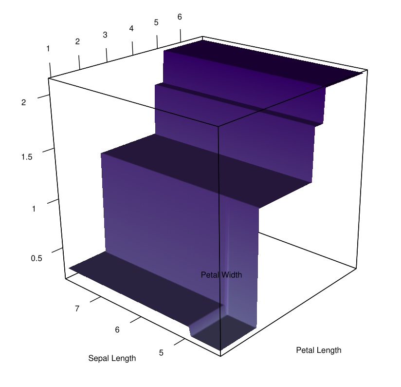

The codes to construct random forests with missing data are found in <a href="https://github.com/IrvingGomez/Random_forests_with_missing_values">https://github.com/IrvingGomez/Random_forests_with_missing_values</a>. There, it is possible to find examples on its use, in particular the example <a href="https://github.com/IrvingGomez/Random_forests_with_missing_values/blob/main/examples/Example_Anderson%20iris.ipynb">Example_Anderson iris.ipynb</a> shows most of the features.

Here are two images as an example, representing a decision tree with missing values.

   
